# Contributor Manual

We welcome contributions of any size and skill level. As an open source project, we believe in giving back to our contributors and are happy to help with guidance on PRs, technical writing, and turning any feature idea into a reality.

> [!Tip]
>
> **For new contributors:** Take a look at [https://github.com/firstcontributions/first-contributions](https://github.com/firstcontributions/first-contributions) for helpful information on contributing

## Quick Guide

### Prerequisites

```shell
node: "^>=18.20.8"
pnpm: "^9.12.1"
# otherwise, your build will fail
```

We recommend using Corepack, [read PNPM docs](https://pnpm.io/installation#using-corepack).

### Setting up your local repo

Astro uses pnpm workspaces, so you should **always run `pnpm install` from the top-level project directory**. Running `pnpm install` in the top-level project root will install dependencies for `astro`, and every package in the repo.

```shell
git clone && cd ...
pnpm install
pnpm run build
```

In [#2254](https://github.com/withastro/astro/pull/2254) a `.git-blame-ignore-revs` file was added to ignore repo-wide formatting changes. To improve your experience, you should run the following command locally.

```shell
git config --local blame.ignoreRevsFile .git-blame-ignore-revs
```

To automatically handle merge conflicts in `pnpm-lock.yaml`, you should run the following commands locally.

```shell
pnpm add -g @pnpm/merge-driver
pnpm dlx npm-merge-driver install --driver-name pnpm-merge-driver --driver "pnpm-merge-driver %A %O %B %P" --files pnpm-lock.yaml
```

### Using GitHub Codespaces for development

To get started, create a codespace for this repository by clicking this 👇

[](https://codespaces.new/withastro/astro)

Your new codespace will open in a web-based version of Visual Studio Code. All development dependencies will be preinstalled, and the tests will run automatically ensuring you've got a green base from which to start working.

> [!Note]
> Dev containers is now an open spec which is supported by [GitHub Codespaces](https://github.com/codespaces) and [other supporting tools](https://containers.dev/supporting).

### Development

```shell
# starts a file-watching, live-reloading dev script for active development
pnpm run dev
# build the entire project, one time.
pnpm run build
```

**How can I test my changes while contributing to the repository?**

During the development process, you may want to test your changes to ensure they are working as expected. Here are a few ways to do it:

1. Run any of the examples in the `/examples` folder. They are linked to use the local Astro source code, so you can see the effects of your changes.

   ```shell
     pnpm --filter @example/minimal run dev
   ```

2. Write a test and run it. This is useful if you're making a specific fix and want to see if your changes are working as expected.

3. Create a separate project and use your local Astro through [`pnpm link`](https://pnpm.io/cli/link). This is helpful if you're making bigger changes and want to test them in a separate project.

Overall, it's up to personal preference which method to use. For smaller changes, using the examples folder may be sufficient. For larger changes, using a separate project may be more appropriate.

#### Naming convention and APIs usage

> [!NOTE]
> This is a requirement that is applied only to the `packages/astro` source code.

> [!IMPORTANT]
> This convention is recent, the source code might not follow this convention yet.

The use of `Node.js` APIs e.g. `node:` is limited and should be done only in specific parts of the code. The reason why
the project can't use `Node.js` APIs at will is because Astro code might run in environments that support runtimes other than
Node.js. An example is Cloudflare Workers.

Code that is runtime-agnostic (i.e. code that shouldn't use Node.js APIs) should be placed inside folders or files called `runtime` (`runtime/` or `runtime.ts`).

You can use `Node.js` APIs inside the implementation of the vite plugins, but if the vite plugin returns a virtual module, that virtual module can't use Node.js APIs.

#### Debugging Vite

You can debug vite by prefixing any command with `DEBUG` like so:

```shell
DEBUG=vite:* astro dev        # debug everything in Vite
DEBUG=vite:[name] astro dev   # debug specific process, e.g. "vite:deps" or "vite:transform"
```

### Running tests

```shell
# run this in the top-level project root to run all tests
pnpm run test
# run only a few tests in the `astro` package, great for working on a single feature
# (example - `pnpm run test:match "cli"` runs tests with "cli" in the name)
pnpm run test:match "$STRING_MATCH"
# run tests on another package
# (example - `pnpm --filter @astrojs/rss run test` runs `packages/astro-rss/test/rss.test.js`)
pnpm --filter $STRING_MATCH run test
```

Most tests use [`mocha`](https://mochajs.org) as the test runner. We're slowly migrating to use [`node:test`](https://nodejs.org/api/test.html) instead through the custom [`astro-scripts test`](./scripts/cmd/test.js) command. For packages that use `node:test`, you can run these commands in their directories:

```shell
# run all of the package's tests
pnpm run test
# run only a few tests in the package
# (example - `pnpm run test -m "cli"` runs tests with "cli" in the name)
pnpm run test -m "$STRING_MATCH"
# run a single test file, you can use `node --test` directly
node --test ./test/foo.test.js
```

#### Running a single test

Sometimes you want to run a single test case (`it` or `describe`) or a single test file. You can do so by using Node.js.

To run a single test file, for example `test/astro-basic.test.js`:

```shell
node --test test/astro-basic.test.js
```

If you wish to run a single test case, you have to postfix `it` and `describe` functions with `.only`:

```diff
// test/astro-basic.test.js
- describe("description", () => {
+ describe.only("description", () => {
-  it("description", () => {
+  it.only("description", () => {})
})
```

Then, you have to pass the `--test-only` option to the Node.js:

```shell
node --test --test-only test/astro-basic.test.js
```

> [!WARNING]
>
> 1. If you have nested `describe`, all of them must postfix with `.only`
> 2. `--test-only` and `--test` must be placed **before** declaring the path to the file. Failing to do so will test all files

#### Debugging tests in CI

There might be occasions where some tests fail in certain CI runs due to some timeout issue. If this happens, it will be very difficult to understand which file cause the timeout. That's caused by come quirks of the Node.js test runner combined with our architecture.

To understand which file causes the issue, you can modify the `test` script inside the `package.json` by adding the `--parallel` option:

```diff
{
-  "test": "astro-scripts test \"test/**/*.test.js\"",
+  "test": "astro-scripts test --parallel \"test/**/*.test.js\"",
}
```

Save the change and **push it** to your PR. This change will make the test CI slower, but it will allow to see which files causes the timeout. Once you fixed the issue **revert the change and push it**.

#### E2E tests

Certain features, like HMR and client hydration, need end-to-end tests to verify functionality in the dev server. [Playwright](https://playwright.dev/) is used to test against the dev server.

```shell
# run this in the top-level project root to run all E2E tests
pnpm run test:e2e
# run only a few tests, great for working on a single feature
# (example - `pnpm run test:e2e:match "Tailwind CSS" runs `tailwindcss.test.js`)
pnpm run test:e2e:match "$STRING_MATCH"
```

**When should you add E2E tests?**

Any tests for `astro build` output should use the main `mocha` tests rather than E2E - these tests will run faster than having Playwright start the `astro preview` server.

If a test needs to validate what happens on the page after it's loading in the browser, that's a perfect use for E2E dev server tests, i.e. to verify that hot-module reloading works in `astro dev` or that components were client hydrated and are interactive.

#### Creating tests

When creating new tests, it's best to reference other existing test files and replicate the same setup. Some other tips include:

- When re-using a fixture multiple times with different configurations, you should also configure unique `outDir`, `build.client`, and `build.server` values so the build output runtime isn't cached and shared by ESM between test runs.

### Other useful commands

```shell
# auto-format the entire project
# (optional - a GitHub Action formats every commit after a PR is merged)
pnpm run format
```

```shell
# lint the project
# (optional - our linter creates helpful warnings, but not errors.)
pnpm run lint
```

### Making a Pull Request

When making a pull request, be sure to add a changeset when something has changed with Astro. Non-packages (`examples/*`) do not need changesets.

```shell
pnpm exec changeset
```

### Running benchmarks

We have benchmarks to keep performance under control. They are located in the `benchmarks` directory, and it exposes a CLI you can use to run them.

You can run all available benchmarks sequentially by running (from the project root):

```shell
pnpm run benchmark
```

To run a specific benchmark only, you can add the name of the benchmark after the command:

```shell
pnpm run benchmark memory
```

Use `pnpm run benchmark --help` to see all available options.

To run these benchmarks in a PR on GitHub instead of using the CLI, you can comment `!bench`. The benchmarks will run on both the PR branch and the `main` branch, and the results will be posted as a new comment.

To run only a specific benchmark on CI, add its name after the command in your comment, for example, `!bench memory`.

## For maintainers

This paragraph provides some guidance to the maintainers of the monorepo. The guidelines explained here aren't necessarily followed by other repositories of the same GitHub organisation.

### Issue triaging workflow

```mermaid
graph TD;
    start{Followed issue <br/> template?}
    start --NO--> close1[Close and ask to <br/> follow template.]
    start --YES--> dupe{Is duplicate?}
    dupe --YES--> close2[Close and point <br/> to duplicate.]
    dupe --NO--> repro{Has proper <br/> reproduction?}
    repro --NO--> close3[Add&nbsp;label:&nbsp;'needs&nbsp;repro'. <br/> Bot will auto close if no <br/>update was made in 3 days.]
    repro --YES--> real{Is actually a bug?}
    real --NO--> maybefeat{Is it a feature request?}
    maybefeat -- YES --> roadmap[Close the issue. <br/> Point user to the roadmap.]
    maybefeat -- NO --> intended{Is the intended <br/> behaviour?}
    intended --YES--> explain[Explain and close. <br/> Point to docs if needed.]
    intended --NO--> open[Add&nbsp;label:&nbsp;'needs&nbsp;discussion'.<br/>Remove&nbsp;label:&nbsp;'needs&nbsp;triage'.]
    real --YES--> real2["∙&nbsp;Remove&nbsp;label:&nbsp;'needs&nbsp;triage'. <br/> ∙ Add related feature label if <br/> applicable. (e.g. 'feat: ssr') <br/> ∙ Add priority and meta labels. (see below)"]
    style real2 text-wrap:balance
    real2 --> tolabel[Use the framework below <br/> to decide the priority <br/> of the issue and choose <br/> the correct label.]

```



### Assign priority to bugs

The Astro project has five levels of priority to issues, where `p5` is the highest in priority, and `p1` is the lowest in priority.

- `p5`: the bug impacts the majority of Astro projects, it doesn't have a workaround and makes Astro unusable/unstable.

  Some examples:
  - the dev server crashes;
  - the build breaks and doesn't complete;
  - huge regressions in terms of performance;

  Bugs violate the documentation/intended behaviour of the feature, although sometimes the documentation might not cover possible edge cases.

  Usually we **don't** assign this priority to packages that **aren't** `astro`, but that can change.

- `p4`: the bug impacts _many_ Astro projects, it doesn't have a workaround but Astro is still stable/usable.
- `p3`: any bug that doesn't fall in the `p4` or `p5` category. If the documentation doesn't cover
  the case reported by the user, it's useful to initiate a discussion via the `"needs discussion"` label. Seek opinions from OP and other maintainers.
- `p2`: all the bugs that have workarounds.
- `p1`: very minor bug, that impacts a small amount of users. Sometimes it's an edge case and it's easy to fix. Very useful if you want to assign the fix to a first-time contributor.

> [!IMPORTANT]
> The priority of a bug isn't set on stone. It can change based on different factors.

Assigning labels isn't always easy and many times the distinction between the different levels of priority is blurry, hence try to follow these guidelines:

- When assigning a `p2`, **always** add a comment that explains the workaround. If a workaround isn't provided, ping the person that assigned the label and ask them to provide one.
- Astro has **many** features, but there are some that have a larger impact than others: development server, build command, HMR (TBD, we don't have a page that explains expectations of HMR in Astro), **evident** regressions in performance.
- In case the number of reactions of an issue grows, the number of users affected grows, or a discussion uncovers some insights that weren't clear before, it's OK to change the priority of the issue. The maintainer **should** provide an explanation when assigning a different label.
  As with any other contribution, triaging is voluntary and best-efforts. We welcome and appreciate all the help you're happy to give (including reading this!) and nothing more. If you are not confident about an issue, you are welcome to leave an issue untriaged for someone who would have more context, or to bring it to their attention.

### Preview releases

You can trigger a preview release **from a PR** anytime by using the label `pr preview`. Add this label, and a workflow will trigger, which at the end will add a comment with the instructions of how to install the preview release. A preview release will be created for each package that has a pending changeset.

If you're in need to trigger multiple preview releases from the same PR, remove the label and add it again.

## Code Structure

Server-side rendering (SSR) can be complicated. The Astro package (`packages/astro`) is structured in a way to help think about the different systems.

- `components/`: Built-in components to use in your project (e.g. `import Code from 'astro/components/Code.astro'`)
- `src/`: Astro source
  - `types/`: TypeScript types. These are centralized to cut down on circular dependencies
  - `cli/`: Code that powers the `astro` CLI command
  - `core/`: Code that executes **in the top-level scope** (in Node). Within, you’ll find code that powers the `astro build` and `astro dev` commands, as well as top-level SSR code.
  - `runtime/`: Code that executes **in different scopes** (i.e. not in a pure Node context). You’ll have to think about code differently here.
    - `client/`: Code that executes **in the browser.** Astro’s partial hydration code lives here, and only browser-compatible code can be used.
    - `server/`: Code that executes **inside Vite’s SSR.** Though this is a Node environment inside, this will be executed independently of `core/` and may have to be structured differently.
  - `vite-plugin-*/`: Any Vite plugins that Astro needs to run. For the most part, these also execute within Vite similar to `src/runtime/server/`, but it’s also helpful to think about them as independent modules. _Note: at the moment these are internal while they’re in development_

### Thinking about SSR

There are 3 contexts in which code executes:

- **Node.js**: this code lives in `src/core/`.
- **Inside Vite**: this code lives in `src/runtime/server/`.
- **In the browser**: this code lives in `src/runtime/client/`.

Understanding in which environment code runs, and at which stage in the process, can help clarify thinking about what Astro is doing. It also helps with debugging, for instance, if you’re working within `src/core/`, you know that your code isn’t executing within Vite, so you don’t have to debug Vite’s setup. But you will have to debug vite inside `runtime/server/`.

## Branches

### `main`

Active Astro development happens on the [`main`](https://github.com/withastro/astro/tree/main) branch. `main` always reflects the latest code.

> [!Note]
> During certain periods, we put `main` into a [**prerelease**](https://github.com/changesets/changesets/blob/main/docs/prereleases.md#prereleases) state. Read more about [Releasing Astro](#releasing-astro).

### `latest`

The **stable** release of Astro can always be found on the [`latest`](https://github.com/withastro/astro/tree/latest) branch. `latest` is automatically updated every time we publish a stable (not prerelease) version of Astro.

By default, `create-astro` and [astro.new](https://astro.new) point to this branch.

## Releasing Astro

> [!Note]
> Only [core maintainers (L3+)](https://github.com/withastro/.github/blob/main/GOVERNANCE.md#level-3-l3---core) can release new versions of Astro.

The repo is set up with automatic releases, using the changeset GitHub action & bot.

To release a new version of Astro, find the `[ci] release` PR, read it over, and merge it.

### Releasing PR preview snapshots

Our release tool `changeset` has a feature for releasing "snapshot" releases from a PR or custom branch. These are npm package publishes that live temporarily, so that you can give users a way to test a PR before merging. This can be a great way to get early user feedback while still in the PR review process.

To run `changeset version` locally, you'll need to create a GitHub [personal access token](https://docs.github.com/en/authentication/keeping-your-account-and-data-secure/creating-a-personal-access-token) and set it as a `GITHUB_TOKEN` environment variable.

To release a snapshot, run the following locally:

```shell
# Notes:
# - YYY should be a keyword to identify this release. Ex: `--snapshot routing` & `--tag next--routing`
# - Use npm/npx instead of pnpm, since npm handles registry login, authentication and publishing.
# - Adding GITHUB_TOKEN in the command adds that token to your bash history. Set a short expiration!

# 1: Tag the new release versions
GITHUB_TOKEN=XXX npx changeset version --snapshot YYY
# 2: Review the diff, and make sure that you're not releasing more than you need to.
git checkout -- examples/
# 3: Release
npm run release --tag next--YYY
# 4: If you're satisfied, you can now throw out all local changes
git reset --hard
```

By default, every package with a changeset will be released. If you only want to target a smaller subset of packages for release, you can consider clearing out the `.changesets` directory to replace all existing changesets with a single changeset of only the packages that you want to release. Just be sure not to commit or push this to `main`, since it will destroy existing changesets that you will still want to eventually release.

Full documentation: https://github.com/changesets/changesets/blob/main/docs/snapshot-releases.md

### Releasing `astro@next` (aka "prerelease mode")

Sometimes, the repo will enter into "prerelease mode". In prerelease mode, our normal release process will publish npm versions under the `next` dist-tag, instead of the default `latest` tag. We do this from time-to-time to test large features before sharing them with the larger Astro audience.

While in prerelease mode, follow the normal release process to release `astro@next` instead of `astro@latest`. To release `astro@latest` instead, see [Releasing `astro@latest` while in prerelease mode](#releasing-astrolatest-while-in-prerelease-mode).

Full documentation: https://github.com/changesets/changesets/blob/main/docs/prereleases.md

### Entering prerelease mode

If you have gotten permission from the core contributors, you can enter into prerelease mode with the following steps:

- Run: `pnpm exec changeset pre enter next` in the project root
- Update `.changeset/config.json` with `"baseBranch": "next"` (for easier changesets creation)
- Create a new PR from the changes created by this command
- Review, approve, and merge the PR to enter prerelease mode.
- If successful, The "[ci] release" PR (if one exists) will now say "[ci] release (next)".

### Exiting prerelease mode

Exiting prerelease mode should happen once an experimental release is ready to go from `npm install astro@next` to `npm install astro`. Only a core contributor can run these steps:

- Run: `pnpm exec changeset pre exit` in the project root
- Update `.changeset/config.json` with `"baseBranch": "main"`
- Create a new PR from the changes created by this command.
- Review, approve, and merge the PR to enter prerelease mode.
- If successful, The "[ci] release (next)" PR (if one exists) will now say "[ci] release".

### Releasing `astro@latest` while in prerelease mode

When in prerelease mode, the automatic PR release process will no longer release `astro@latest`, and will instead release `astro@next`. That means that releasing to `latest` becomes a manual process. To release latest manually while in prerelease mode:

1. _In the code snippets below, replace `0.X` with your version (ex: `0.18`, `release/0.18`, etc.)._
1. Create a new `release/0.X` branch, if none exists.
1. Point `release/0.X` to the latest commit for the `v0.X` version.
1. `git cherry-pick` commits from `main`, as needed.
1. Make sure that all changesets for the new release are included. You can create some manually (via `pnpm exec changeset`) if needed.
1. Run `pnpm exec changeset version` to create your new release.
1. Run `pnpm exec release` to publish your new release.
1. Run `git push && git push --tags` to push your new release to GitHub.
1. Run `git push release/0.X:latest` to push your release branch to `latest`.
1. Go to https://github.com/withastro/astro/releases/new and create a new release. Copy the new changelog entry from https://github.com/withastro/astro/blob/latest/packages/astro/CHANGELOG.md.
1. Post in Discord #announcements channel, if needed!

## Documentation

Help us make [docs.astro.build](https://docs.astro.build/) as accurate and easy-to-use as possible. Contributing to documentation can be a great way to get involved with open source development without having to code.

Head over to [the `withastro/docs` repo](https://github.com/withastro/docs) to get involved!
