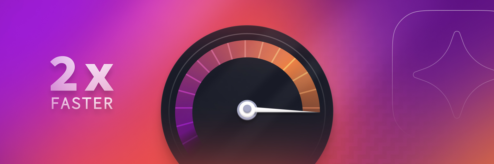

## Faster, Stronger, Betterer

Hey there, Nebulous users! We're back with some exciting updates that will turbocharge your Nebulous experience. Here's the lowdown:

### New Features & Enhancements

- **NebulaProtect Supercharged:** Enjoy beefed-up security and real-time monitoring to keep your digital fortress unbreachable.
- **NebulaConnect for Teams:** Collaboration is a breeze with integrated project management tools.
- **Speed Boost Galore:** We've fine-tuned Nebulous for ultimate speed and responsiveness.

### 🐞 Bug Fixes

- Kicked pesky crashes out the door for NebulaSync.
- Fixed rare data hiccups during file transfers.
- Nebulous is now even friendly with older devices.

Thank you for making Nebulous your tech partner. We thrive on your feedback, so if you have ideas or run into bumps, don't hesitate to drop a line to our support wizards. Together, we're taking Nebulous to the next level!
