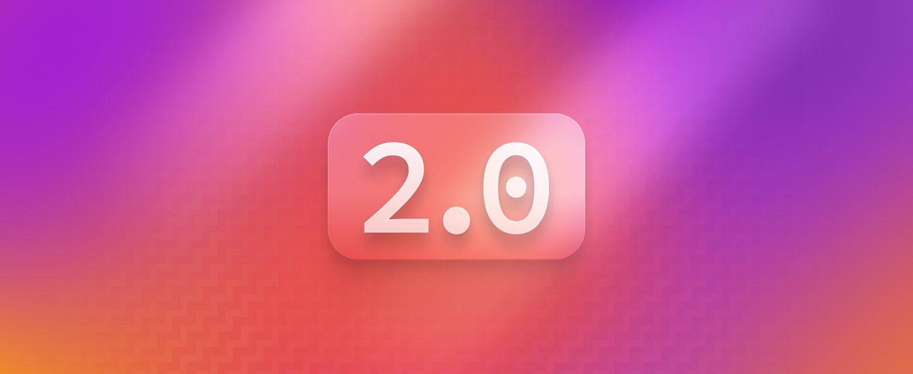

## Introducing Nebulous 2.0!

Greetings, Nebulous users! We're excited to bring you the latest updates in our [ever-evolving tech ecosystem](#). In this release, we're introducing some exciting new features and squashing a few pesky bugs. Let's dive in!

### 🍿 New Features & Enhancements

- **NebulaSync v2.0:** We're thrilled to introduce NebulaSync 2.0, our revamped file synchronization tool. It now offers blazing-fast sync speeds, improved reliability, and enhanced cross-device compatibility.
- **Enhanced NebulaProtect:** NebulaProtect, our comprehensive security suite, has received a major update. Enjoy advanced threat detection, and real-time monitoring.
- **NebulaConnect for Teams:** Collaborate effortlessly with NebulaConnect for Teams. This powerful feature allows seamless integration with your favorite project management tools, enabling you to manage tasks, share documents, and track progress in real-time.

### 🐞 Bug Fixes

- Resolved occasional crashing issues when using NebulaSync.
- Fixed a bug causing data corruption in rare cases during file transfers.
- Improved compatibility with older devices to ensure a seamless experience for all users.
- Enhanced error handling and reporting for a smoother user experience.

### 👀 Coming Soon

We can't spill all the beans just yet, but we're thrilled to give you a sneak peek of what's coming in the next Nebulous release:

- **NebulaWallet:** A secure and user-friendly cryptocurrency wallet integrated directly into Nebulous for seamless digital asset management.
- **NebulaConnect Mobile:** Take your collaboration to the next level with our upcoming mobile app, enabling you to work on the go.
- **NebulaLabs:** Our developer tools and API enhancements, providing you with even more customization options and possibilities.

If you have any suggestions or encounter any issues, don't hesitate to reach out to our support team. Together, we'll continue to make Nebulous the ultimate tech solution for you.
