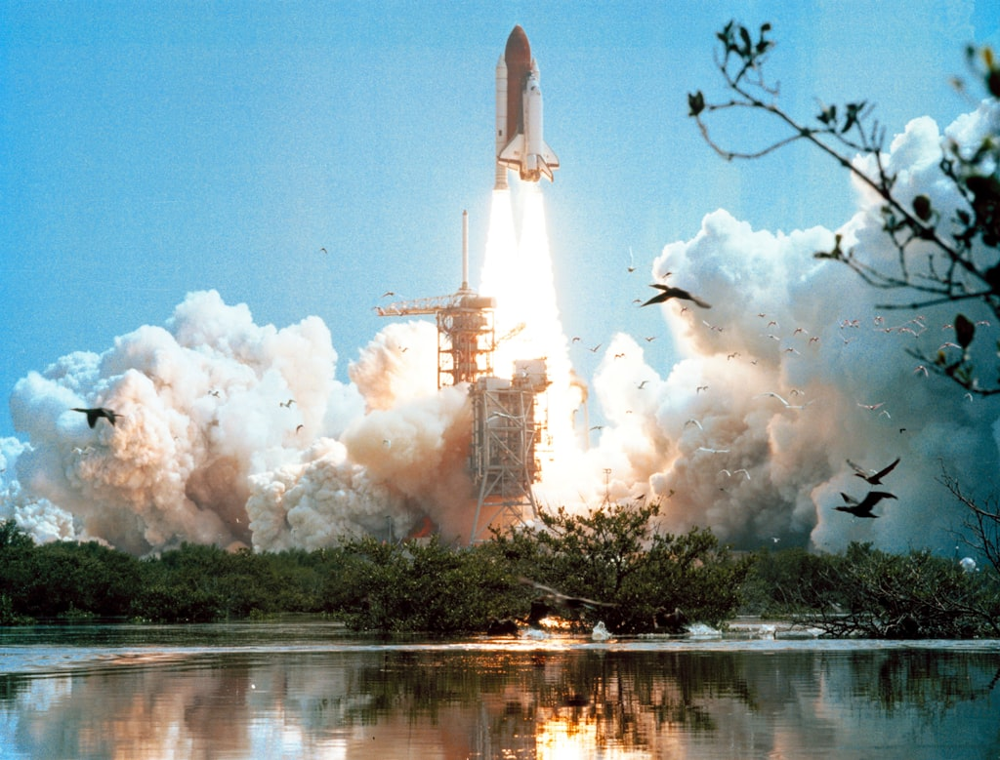

**Source:** [Wikipedia](https://en.wikipedia.org/wiki/Apollo_Lunar_Module)

The Lunar Module (LM, pronounced "Lem"), originally designated the Lunar Excursion Module (LEM), was the lander spacecraft that was flown between lunar orbit and the Moon's surface during the U.S. Apollo program. It was the first crewed spacecraft to operate exclusively in the airless vacuum of space, and remains the only crewed vehicle to land anywhere beyond Earth.

